# Workout Planner - Visual Entity Relationship Diagram

## Main ERD with Table Connections

```mermaid
erDiagram
    USER {
        bigint user_id PK "🔑 Primary Key"
        varchar username UK "👤 Unique"
        varchar password_hash "🔐 Encrypted"
        varchar email UK "📧 Unique"
        varchar first_name "👤 First Name"
        varchar last_name "👤 Last Name"
    }

    EXERCISE {
        bigint exercise_id PK "🔑 Primary Key"
        varchar name "🏋️ Exercise Name"
        varchar description "📝 Description"
        enum type "💪 STRENGTH|CARDIO|FLEXIBILITY"
        enum target_muscle_group "🎯 Muscle Group"
        enum difficulty_level "⭐ BEGINNER|INTERMEDIATE|ADVANCED"
        varchar image_url "🖼️ Image URL"
    }

    WORKOUT_SESSION {
        bigint session_id PK "🔑 Primary Key"
        varchar name "📋 Session Name"
        varchar description "📝 Description"
        bigint user_id FK "🔗 References USER"
        enum status "📊 PLANNED|IN_PROGRESS|COMPLETED|CANCELLED|PAUSED"
        datetime started_at "⏰ Start Time"
        datetime completed_at "✅ End Time"
        integer actual_duration_in_minutes "⏱️ Duration"
        varchar session_notes "📝 Notes"
    }

    WORKOUT_EXERCISE {
        bigint workout_exercise_id PK "🔑 Primary Key"
        bigint session_id FK "🔗 References WORKOUT_SESSION"
        bigint exercise_id FK "🔗 References EXERCISE"
        integer order_in_workout "🔢 Order"
        varchar notes "📝 Exercise Notes"
    }

    STRENGTH_SET {
        bigint set_id PK "🔑 Primary Key"
        bigint workout_exercise_id FK "🔗 References WORKOUT_EXERCISE"
        integer set_number "🔢 Set Number"
        integer reps "💪 Repetitions"
        decimal weight "🏋️ Weight (kg/lbs)"
        integer rest_time_in_seconds "⏱️ Rest Time"
        varchar notes "📝 Set Notes"
        boolean completed "✅ Completed"
    }

    CARDIO_SET {
        bigint set_id PK "🔑 Primary Key"
        bigint workout_exercise_id FK "🔗 References WORKOUT_EXERCISE"
        integer set_number "🔢 Set Number"
        integer duration_in_seconds "⏱️ Duration"
        decimal distance "📏 Distance"
        varchar distance_unit "📐 Unit (km/miles)"
        integer rest_time_in_seconds "⏱️ Rest Time"
        varchar notes "📝 Set Notes"
        boolean completed "✅ Completed"
    }

    FLEXIBILITY_SET {
        bigint set_id PK "🔑 Primary Key"
        bigint workout_exercise_id FK "🔗 References WORKOUT_EXERCISE"
        integer set_number "🔢 Set Number"
        integer duration_in_seconds "⏱️ Duration"
        varchar stretch_type "🤸 Stretch Type"
        integer intensity "🔥 Intensity (1-10)"
        integer rest_time_in_seconds "⏱️ Rest Time"
        varchar notes "📝 Set Notes"
        boolean completed "✅ Completed"
    }

    %% Visual Relationships with Clear Connection Types
    USER ||--o{ WORKOUT_SESSION : "1:N\n👤 User creates sessions"
    WORKOUT_SESSION ||--o{ WORKOUT_EXERCISE : "1:N\n📋 Session contains exercises"
    EXERCISE ||--o{ WORKOUT_EXERCISE : "1:N\n🏋️ Exercise used in workouts"
    WORKOUT_EXERCISE ||--o{ STRENGTH_SET : "1:N\n💪 Has strength sets"
    WORKOUT_EXERCISE ||--o{ CARDIO_SET : "1:N\n🏃 Has cardio sets"
    WORKOUT_EXERCISE ||--o{ FLEXIBILITY_SET : "1:N\n🤸 Has flexibility sets"
```

## Simplified Visual Flow Diagram

```mermaid
graph TD
    A[👤 USER] -->|creates| B[📋 WORKOUT_SESSION]
    B -->|contains| C[🔗 WORKOUT_EXERCISE]
    D[🏋️ EXERCISE] -->|template for| C
    
    C -->|has sets of type| E[💪 STRENGTH_SET]
    C -->|has sets of type| F[🏃 CARDIO_SET]
    C -->|has sets of type| G[🤸 FLEXIBILITY_SET]
    
    style A fill:#e1f5fe
    style B fill:#f3e5f5
    style C fill:#fff3e0
    style D fill:#e8f5e8
    style E fill:#ffebee
    style F fill:#e0f2f1
    style G fill:#fce4ec
```

## Entity Relationships Explained

### Core Relationships
1. **USER → WORKOUT_SESSION** (One-to-Many)
   - A user can have multiple workout sessions
   - Each workout session belongs to one user

2. **WORKOUT_SESSION → WORKOUT_EXERCISE** (One-to-Many)
   - A workout session contains multiple exercises
   - Each workout exercise belongs to one session
   - Ordered by `order_in_workout`

3. **EXERCISE → WORKOUT_EXERCISE** (One-to-Many)
   - An exercise can be used in multiple workout sessions
   - Each workout exercise references one exercise template
   - This is the junction table with additional attributes

### Set Relationships
4. **WORKOUT_EXERCISE → STRENGTH_SET** (One-to-Many)
   - A workout exercise can have multiple strength sets
   - Each set belongs to one workout exercise
   - Ordered by `set_number`

5. **WORKOUT_EXERCISE → CARDIO_SET** (One-to-Many)
   - A workout exercise can have multiple cardio sets
   - Each set belongs to one workout exercise
   - Ordered by `set_number`

6. **WORKOUT_EXERCISE → FLEXIBILITY_SET** (One-to-Many)
   - A workout exercise can have multiple flexibility sets
   - Each set belongs to one workout exercise
   - Ordered by `set_number`

## Key Design Features

### Normalization
- **3rd Normal Form (3NF)**: No redundant data
- **Exercise** is a master catalog (static data)
- **WorkoutExercise** is the junction table with instance-specific data
- **Sets** contain the actual workout performance data

### Polymorphism
- Three different set types based on exercise type:
  - **StrengthSet**: reps, weight, rest time
  - **CardioSet**: duration, distance, distance unit
  - **FlexibilitySet**: duration, stretch type, intensity

### Data Integrity
- Foreign key constraints maintain referential integrity
- Unique constraints on username and email
- Proper ordering with `order_in_workout` and `set_number`
- Enum constraints for controlled vocabulary

### Performance Considerations
- Lazy loading for relationships
- Proper indexing on foreign keys
- Separate tables for different set types (Table Per Class inheritance)
